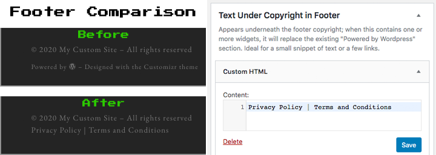

# Customizr Child Theme

Basic child theme for the WordPress theme [Customizr](https://wordpress.org/themes/customizr/) from [Press Customizr](https://presscustomizr.com/).  Adds a custom widget area under the footer's copyright section to optionally replace the text underneath it.  Please note, this theme has not yet been tested with Customizr Pro. 

## Setup Instructions
* Install the [Customizr](https://wordpress.org/themes/customizr/) theme if it hasn't already been installed.
  * In the WordPress admin area, go to Appearance » Themes, and click the Add New button.
  * Search for Customizr, then click the Install button on the theme.
* Go to [https://github.com/dcpesses/customizr-child-theme/releases](https://github.com/dcpesses/customizr-child-theme/releases) and download the latest .zip from the GitHub project.
* Switch back to your WordPress admin, go to Appearance » Themes, and click the Add New button.
* Click the Upload Theme button, then click Choose File.  Select the .zip file you previously downloaded, then click the Install Now button.
* If all goes well, you should see a link to Activate or Live Preview on the following page. 

## License
See [LICENSE](LICENSE)